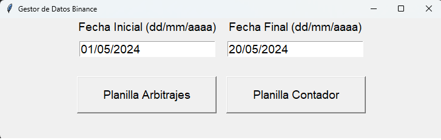

# DataExctract_Binance

## Descripción General

Esta app esta diseñada con la finalidad de facilitar la actividad contable de aquellas personas dedicadas a la compra venta de criptomonedas en el Exchange Binance
Permitiendo facilitar el tedioso proceso contable que deber ser efectuado mes a mes. 

`La app es un ETL` con una interfaz de usuario desarrollada en Tkinter, la misma se compone de 2 botones y  2 entradas para introducir fechas.

En los campos `Fecha Inicial` y `Fecha Final` se introduce el rango de fechas sobre el que se quiere obtener datos.Luego la app nos brinda 2 opciones 
"Planilla Arbitraje" , "Planilla Contador" . ambas opciones extraen datos similares, su principal diferencia radica en la cantidad de dimensiones y registros que se obtiene, "Planilla Arbitrajes" descarga datos de interes para el usuario, mientras que Planilla Contador, extrae una mayor cantidad de datos, los cuales son necesarios para llevar un proceso contable optimo.

Cabe aclarar que desde el codigo pueden seleccionarse las dimensiones que el usuario considere necesarias, en este caso las mismas están seleccionadas en base a necesidades propias.

## Funcionamiento

El ETL se encarga de conectarse con la API de Binance, para establecer la conexión son necesarias una c API KEY y una SECRET KEY, por cuestiones de seguridad las mismas fueron establecidas como variables de entorno. 

Posterior a la extracción los datos son transformados y cargados en google sheet en el formato deseado.Para la carga de datos en google sheet son necesarias credenciales de conexión que me permiten hacer uso de los servicios de google. 

## Herramientas utilizadas 

Python

Google sheet

Librerias/Frameworks: pandas, numpy, pygsheet , requests , os, Tkinter, 

